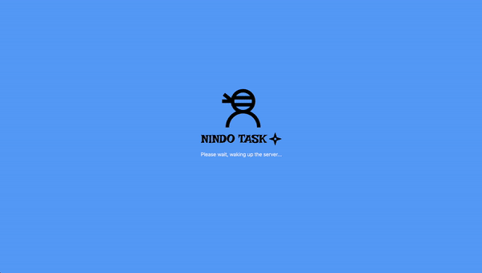
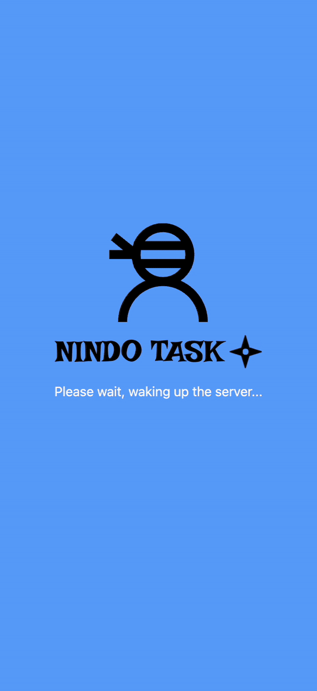

# Nindo Task

Welcome to Nindo Task, a modern task management web application designed to streamline and organize your daily tasks efficiently. This application features a user-friendly interface with smooth animations and intuitive interactions, making task management an effortless experience. Nindo Task is fully responsive, ensuring a seamless user experience on devices of all sizes, from mobile phones to desktop computers.

## Technologies Used

- **Next.js**: For server-side rendering and building the web application.
- **React**: To create interactive UIs for task management functionalities.
- **Tailwind CSS**: For styling and responsive design.
- **JavaScript**: The programming language used to build interactive features.
- **HTML**: The markup language for structuring the content of the web application.

## Getting Started

To get a local copy up and running, follow these steps:

1. **Clone the repository**:

`git clone https://github.com/YourUsername/nindo-task-frontend.git`

2. **Navigate to the project directory**:

`cd nindo-task-frontend`

3. **Install dependencies**:

`npm install`

4. **Run the application**:

`npm run dev`

5. **Open a web browser** and navigate to `http://localhost:3000`.

For the backend functionalities, ensure you have the backend server running. You can find the backend repository and instructions [here](https://github.com/Pensive-Pasta/nindo-task-backend).

## Contributing

Nindo Task is a project aimed at showcasing modern web development techniques with a focus on task management solutions. While contributions are not actively sought, feedback, suggestions, or bug reports are welcome. Feel free to open an issue in the repository or contact me at pensivepasta@gmail.com.

## Preview of responsive breakpoints

Desktop
 

Mobile
 

